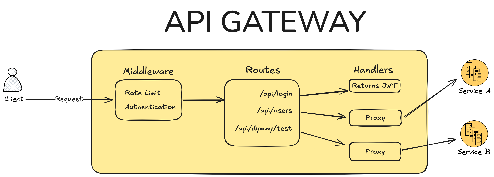
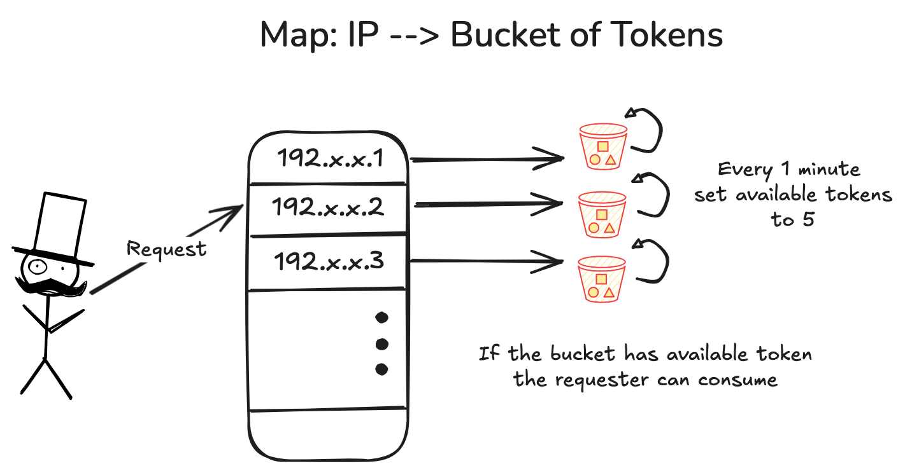
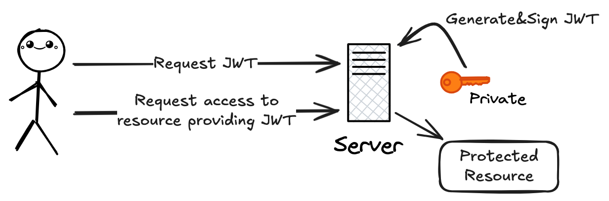

# Pyli: A lightweight API Gateway written in Go

## Table of contents

1. [Introduction](#introduction)
2. [Api Gateway Components](#api-gateway-components)
3. [Demo](#demo)

## Introduction
This is a lightweight API Gateway written in Go, supporting route registration, request proxying, rate limiting, and JWT-based authentication. It’s a toy project built to explore the fundamentals of API gateway design. The gateway is configured through a `config.yaml` file, loaded on startup, which defines key settings such as the listening port, registered routes with their corresponding endpoints, request rate limits, etc.

## Api Gateway Components

1. Middleware
    1. Ratelimiter
    
    2. Authentication
2. Routes
    1. Protected Routes - `/api/dummy/test`
    2. Unprotected Routes - `/api/login`
3. Handlers
    1. JWT Authentication
    
    2. Proxy
